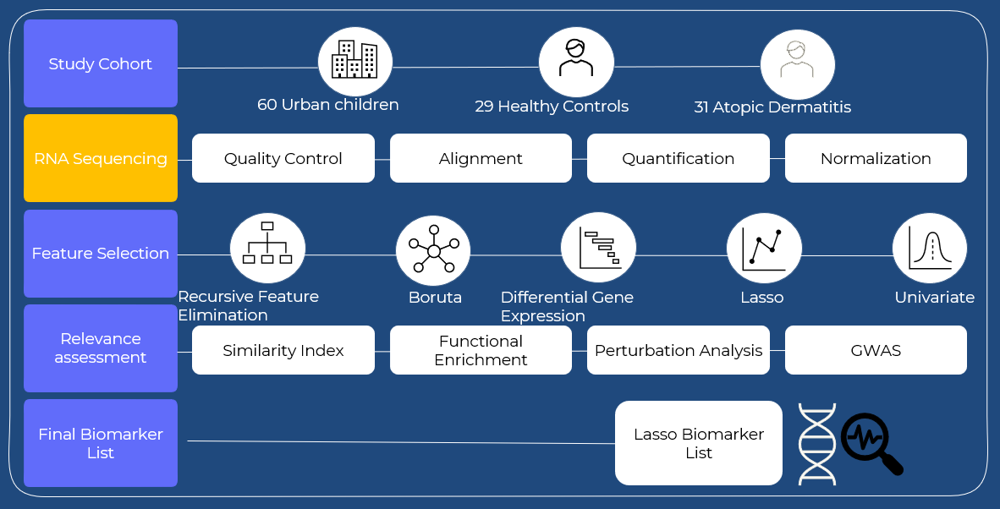

<!-- README.md is generated from README.Rmd. Please edit that file -->

```{r, include = FALSE}
knitr::opts_chunk$set(
  collapse = TRUE,
  comment = "#>",
  fig.path = "man/figures/README-",
  out.width = "100%"
)
```

# GeneSelectR

<!-- badges: start -->
[](https://github.com/dzhakparov/GeneSelectR/actions/workflows/R-CMD-check.yaml)
<!-- badges: end -->

`GeneSelectR` is a machine learning-based R package developed to enhance feature selection and biological assessment in RNAseq analysis of complex biological datasets. Traditional RNAseq datasets can be challenging to analyze due to their high dimensionality. The standard differential gene expression analysis approach has been found to have limitations such as a high false-positive rate and limited gene coverage. The `GeneSelectR` package aims to overcome these limitations using machine learning techniques.



## Installation

You can install the development version of GeneSelectR from [GitHub](https://github.com/) with:

``` r
# install.packages("devtools")
devtools::install_github("dzhakparov/GeneSelectR")
```
## Usage

The `GeneSelectR` package uses four machine learning methods for feature selection:

1. Random Forest
2. Boruta
3. Lasso Regression
4. Univariate Filtering

In addition, the package also performs Gene Ontology (GO) enrichment to assess the biological relevance of gene lists. Semantic similarity analysis of the GO lists is performed using Wang distance and binary cut clustering. The package then selects the best list based on cross-validation mean metrics scores.

## Example
A tutorial detailing how to use GeneSelectR can be seen in this [vignette](https://dzhakparov.github.io/GeneSelectR/vignettes/example.html).
