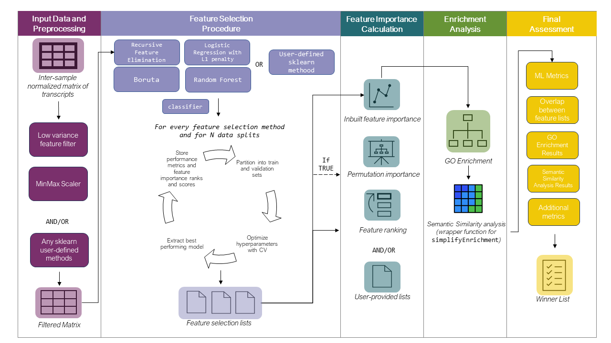

<!-- README.md is generated from README.Rmd. Please edit that file -->

# GeneSelectR

<!-- badges: start -->

[](https://github.com/dzhakparov/GeneSelectR/actions/workflows/R-CMD-check.yaml)


<!-- badges: end -->

## Overview


GeneSelectR is an R package designed to streamline the process of gene
selection and evaluation in bulk RNAseq datasets. Built on top of the
powerful scikit-learn Python library via the reticulate package,
GeneSelectR offers a seamless integration of machine learning and
bioinformatics capabilities in a single workflow.

### Features

Comprehensive Workflow GeneSelectR provides an end-to-end solution for
feature selection, combining the machine learning prowess of
scikit-learn with the bioinformatics utilities of R packages like
clusterprofiler and simplifyEnrichment.

### Customizable Yet User-Friendly

While GeneSelectR offers a high degree of customization to cater to
specific research needs, it also comes with preset configurations that
are suitable for most use-cases, making it accessible for both novice
and experienced users.

### Diverse Feature Selection Methods

The package includes a variety of inbuilt feature selection methods,
such as:

- SelectFromModel with RandomForest
- SelectFromModel with Logistic Regression (L1 penalty)
- Boruta
- Univariate Filtering

### Main Functionality

The core function, GeneSelectR, performs gene selection using various
methods and evaluates their performance through cross-validation. It
also supports hyperparameter tuning, permutation feature importance
calculation, and more.



### Installation

GeneSelectR depends on reticulate that creates a conda working
environment. Please, install
[Anaconda](https://www.anaconda.com/download) distribution before you
proceed. You can install the development version of GeneSelectR from
[GitHub](https://github.com/) with:

``` r
# install.packages("devtools")
devtools::install_github("dzhakparov/GeneSelectR")
```

### Usage and Example

A tutorial detailing how to use GeneSelectR can be accessed in this
[vignette](https://dzhakparov.github.io/GeneSelectR/vignettes/example.html).

### Docker Image

GeneSelectR is available as a container image on Docker Hub. You can
pull the image using the following command:

``` bash
docker pull dzhakparov/geneselectr-image:v1.0
docker run -e PASSWORD=your_password -p 8787:8787 dzhakparov/geneselectr-image:v1.0
```

After running these commands, open your browser and go to localhost:8787
(http//local-ip-address:8787 in Windows). You will be prompted to enter
username and password. The default username is rstudio and the password
is the one you specified in the command above.

### Citation

Please cite the following paper if you use GeneSelectR in your research:

### Feedback and Contribution

Any feedback is welcome and appreciated! Feel free to create issues or
pull requests. For any other questions please write to:
<damir.zhakparov@uzh.ch>.
