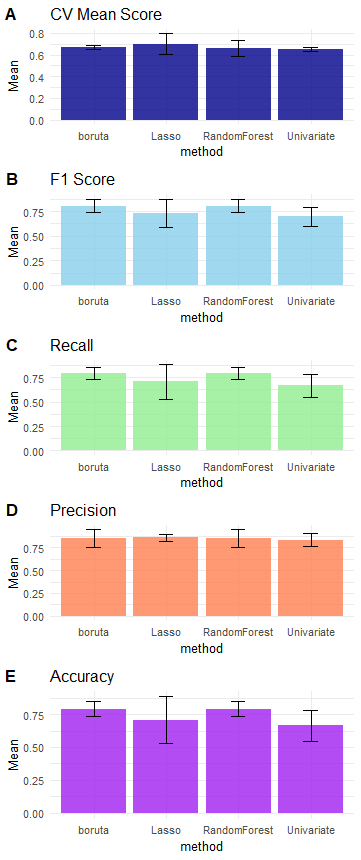
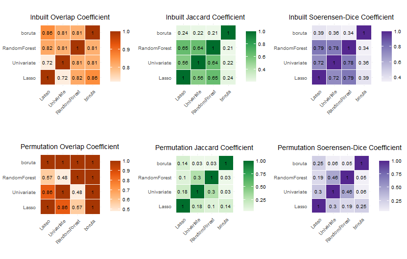
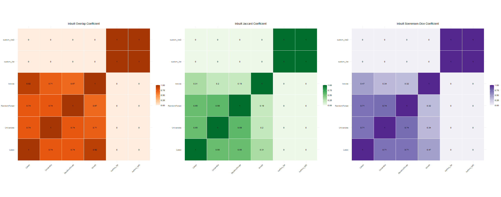

```{r, include = FALSE}
knitr::opts_chunk$set(
  collapse = TRUE,
  comment = "#>", 
  eval = FALSE, #this makes so that chunks are not rerun 
  cache = TRUE,
  warning = FALSE)
```

# Introduction

## Installation

## Python requirements

The feature selection procedure is implemented with Python's scikit-learn library. The package requires an Anaconda installation to work properly. The Python requirements are listed in the requirements.txt file.

You can install the development version of GeneSelectR from [GitHub](%5Bhttps://github.com/)](<https://github.com/>)) with:

```{r}
# install.packages("devtools")
devtools::install_github("dzhakparov/GeneSelectR", build_vignettes = FALSE)

```

## Before you begin

GeneSelectR is based on usage of Python for feature selection via reticulate. When you install the library and launch it for the first time, it is necessary to create the working environment for the package. To do this there is a convenience function:

```{r}
GeneSelectR::configure_environment() 
```

By running it you will be prompted to install a new conda environment with the default name 'GeneSelectR_env' that will be used in your future GeneSelectR sessions. After that you will be asked if you want necessary Python packages to be installed in this working environment.

Due to restrictions the reticulate package has after this initial step is done, it is necessary to start every of your GeneSelectR session with setting up the correct conda working environment:

```{r}
GeneSelectR::set_reticulate_python()
library(GeneSelectR)
# rest of your code 
```

# Basic Example

## Input Data Requirements

The data matrix should be a data frame with samples as rows and features as columns. Example dataset can be accessed via:

```{r}
data("UrbanRandomSubset")
head(UrbanRandomSubset[,1:10])
```

This dataset is a bulk RNAseq dataset that was obtained from blood samples of the 149 African children that were stratified into ones having Atopic Dermatitis (AD) and healthy controls (HC). Additionally, the whole dataset contains the stratification variable by the childrens' location (Urban and Rural). This data snippet contains the Urban samples only. The columns represent the genes and samples are in rows. The column treatment contains diangosis label.

This data subset was used in the PharML 2022 workshop within ECML-PKDD 2022 conference. The whole paper is available with the doi:

## Feature Selection Procedure Basic Usage

As noted before every new session in which you use GeneSelectR should start with the following line, that would allow you to set the correct conda environment:

```{r}
GeneSelectR::set_reticulate_python()
library(GeneSelectR)
library(dplyr)
# the rest of the code
```

Prior to running the feature selection function, let's prepare the data to have a suitable format:

```{r}
X <- UrbanRandomSubset %>% dplyr::select(-treatment) # get the feature matrix
y <- UrbanRandomSubset['treatment'] # store the data point label in a separate vector
```

To run the feature selection procedure with default settings, you should run the GeneSelectR::GeneSelectR() function:

```{r}
selection_results <- GeneSelectR::GeneSelectR(X_train = X, 
                                              y_train = y,
                                              njobs = -1) # all cores will be used
selection_results
```

# Feature Selection
## Feature Selection Procedure

1.  *Settings Defaults*: If not provided, default feature selection methods and hyperparameter grids are established.By default there are four methods implemented to select the features: [Univariate feature selection](https://scikit-learn.org/stable/modules/generated/sklearn.feature_selection.GenericUnivariateSelect.html) , [Logistic regression with L1 penalty](https://scikit-learn.org/stable/modules/generated/sklearn.linear_model.LogisticRegression.html), [boruta](https://github.com/scikit-learn-contrib/boruta_py) and [Random Forest](https://scikit-learn.org/stable/modules/generated/sklearn.ensemble.RandomForestClassifier.html). The default grids for every default feature selection method are as follows:

```{r}
fs_param_grids <- list(
  "Lasso" = list(
    "feature_selector__estimator__C" = c(0.01, 0.1, 1L, 10L),
    "feature_selector__estimator__solver" = c('liblinear','saga')
  ),
  "Univariate" = list(
    "feature_selector__param" = seq(50L, 200L, by = 50L)
  ),
  "boruta" = list(
    "feature_selector__perc" = seq(80L, 100L, by = 10L),
    'feature_selector__n_estimators' = c(50L, 100L, 250L, 500L)
  ),
  "RandomForest" = list(
    "feature_selector__estimator__n_estimators" = seq(100L, 500L,by = 50L),
    "feature_selector__estimator__max_depth" = c(10L, 20L, 30L),
    "feature_selector__estimator__min_samples_split" = c(2L, 5L, 10L),
    "feature_selector__estimator__min_samples_leaf" = c(1L, 2L, 4L),
    "feature_selector__estimator__bootstrap" = c(TRUE, FALSE)
  )
)
```

2.  *Pipeline Selection*: If custom pipelines are provided, they're used. Otherwise, default pipelines are created using the chosen feature selection methods. Pipelines contain two steps: [VarianceThreshold](https://scikit-learn.org/stable/modules/generated/sklearn.feature_selection.VarianceThreshold.html) that is set to 0.85 to filter out low variance features and [MinMaxScaler](https://scikit-learn.org/stable/modules/generated/sklearn.preprocessing.MinMaxScaler.html). As per sklearn workflow to prevent data leakage every pipeline is fit on train and test/validate data separately.

3.  *Repeated Train-Test Splitting*: The data undergoes repeated splitting into training and test sets, with the number of repetitions being defined by n_splits. For each split:

-   Pipelines are iterated over for fitting.
-   Each pipeline undergoes a secondary splitting for validation purposes.
-   Hyperparameter tuning is conducted through grid or randomized search.
-   If the perform_test_split parameter is set to TRUE, the test metrics for the split are computed. ***Attention***: due to the nature of biomedical data most of the time there is not so many samples available. As a general recommendation it is better to set perform_test_split to FALSE if number of samples is under 100. This way only cross validation performance will be reported.

4.  *Feature Importance Calculation*: For each split and each pipeline, feature importance scores are computed. By default model specific, inbuilt feature importance is reported.If calculate_permutation_importance is set to TRUE, permutation feature importance scores are calculated, in addition to inbuilt feature importance scores.

4.1 *Note on Inbuilt vs Permutation feature importance*: GeneSelectR package offers to ways of selecting features, and it is important to understand the difference in these two approaches. In short, these two methods can be summarized in this manner:

-   *Inbuilt (Model-specific) Feature Importance*:
    -   Nature: Derived directly from the model. For instance, in tree-based models like decision trees or random forests, feature importance is based on the number of times a feature is used to split the data.
    -   Speed: Generally faster as it's a by-product of the model training process.
    -   Bias: Might be biased towards features with more categories or higher cardinality.
-   *Permutation Importance*:
    -   Nature: Calculated by permuting the values of each feature and measuring the decrease in the model's performance. If shuffling a feature's values drops the performance significantly, it's deemed important.
    -   Speed: Can be computationally intensive as it involves multiple evaluations of the model.
    -   Bias: Offers a more unbiased approach, especially for features with high cardinality.

***A Note on Permutation Importance***: Permutation importance provides insights specific to the model it's computed for. A feature that's vital for one model might not be for another. Hence, it's crucial to understand that permutation importance doesn't indicate the intrinsic predictive value of a feature in isolation. Moreover, it's vital to have a trustworthy model (with good cross-validation scores) before considering its permutation importance values. Features deemed unimportant in a poorly performing model could be crucial for a well-performing one. It's always recommended to evaluate a model's predictive power using held-out data or cross-validation prior to computing permutation importances. For more information please refere to the [sklearn official documentation on permutation importance](https://scikit-learn.org/stable/modules/permutation_importance.html) 5. Hyperparamter adjustment For the sake of computational time the RandomizedSearchCV is used by default. However, if you want to perform an extensive hyperparameter optimization grid search testing all possible combinations can be performed:

```{r}
selection_results <- GeneSelectR::GeneSelectR(X_train = X, 
                                                y_train = y,
                                                njobs = -1,
                                                search_type = 'grid')
```

6.  Aggregating Results: Across all the splits, mean inbuilt feature importance values with standard deviation are aggregated for each method. Same is done for the permutation importance if it is enabled. Additionally, rank for every feature at every data split is reported.

## Passing Other Feature Selection Methods from sklearn 
If you wish to add any other methods from sklearn, you should pass it as a named list like this:

```{r}
# import the sklearn module
sklearn <- reticulate::import('sklearn')
# define the feature selection submodule and wanted methods with an estimator
feature_selection <- sklearn$feature_selection
select_from_model <- feature_selection$SelectFromModel
RFE <- feature_selection$RFE
rf <- sklearn$ensemble$RandomForestClassifier

my_methods <- list('RFE' = RFE(estimator = rf(), n_features_to_select = 100L),
                   'SelectFromModel' = select_from_model(estimator = rf()))
```

And then we can pass it as an argument to fit_and_evaluate_pipelines function:

```{r}
selection_results <- GeneSelectR::GeneSelectR(X_train = X, 
                                                y_train = y,
                                                njobs = -1,
                                                feature_selection_methods=my_methods)
```

# Structure of the PipelineResults object
The function returns an object of class "PipelineResults", containing: 
- 'best_pipeline': A named list containing parameters of the best performer pipeline . 
- 'cv_results': Results of cross-validation for each pipeline. 
- 'inbuilt_feature_importance': Aggregated inbuilt feature importance scores. 
- 'test_metrics': If the perform_split parameter was set to TRUE, a dataframe of test metrics for each pipeline is returned. 
-'cv_mean_score': A dataframe that summarizes the mean cross-validation scores. 
- 'permutation_importance': If permutation importance was calculated, its mean values are returned.

## Feature Importance Plots 
Finally, you can visualize the most important features for every feature importance method calculation by calling plotting function: 
```{r}
plot_feature_importance(selection_results, top_n_features = 10)
```

The plot will show you the mean feature importance of top n features of your choice by their importance score in descending order. 

## ML Performance Metrics

You can plot the feature selection procedure metrics with the following function:

```{r}
plot_metrics(selection_results)
```

Or access it as a dataframe:

```{r}
selection_results$test_metrics
```

## Overlap Between Gene Lists

Additionally, you can inspect whether genes in your feature selection lists have overlapping features. To do that use the following:

```{r}
overlap <- calculate_overlap_coefficients(selection_results)
overlap 
```
This will return a dataframe that demonstrates three types of overlap coefficients for inbuilt feature importance and permutation importance (if calculated): Soerensen-Dice, Overlap and Jaccard. 
The coefficients can also be visualized as overlap heatmaps. To do so do the following: 
```{r}
plot_overlap_heatmaps(overlap)
```
 
Additionally, if you have any custom lists (e.g. differential gene expression list) you can pass it as an argument like this: 
```{r}
custom_list <- list(custom_list = c('char1','char2','char3','char4','char5'),
                    custom_list2 = c('char1','char2','char3','char4','char5'))
overlap1 <- calculate_overlap_coefficients(selection_results, custom_lists = custom_list)
plot_overlap_heatmaps(overlap1)
```
 

## GO Enrichment analysis

## Conversion to ENTREZIDs

GO Enrichment function only accepts ENTRZIDs to run the analysis. There is a convenience function that will convert your ENSEMBL IDs or Gene names to ENTREZ IDs:

```{r}
# Get the annotations for the genes in the analysis 
# The example dataset contains sequencing from humans 
ah <- AnnotationHub::AnnotationHub()
human_ens <- AnnotationHub::query(ah, c("Homo sapiens", "EnsDb"))
human_ens <- human_ens[['AH98047']]
annotations_ahb <- ensembldb::genes(human_ens, return.type = "data.frame") %>%
 dplyr::select(gene_id,gene_name,entrezid,gene_biotype)

entrez_list <- convert_to_entrezid(pipeline_results = selection_results, ens = annotations_ahb)
```

The conversion functions accepts ENSEMBLIDs, gene names or a combination of both with a separator e.g ENSGXXXXXXXXX_genename. Separator should be specified by the user as a function argument.
