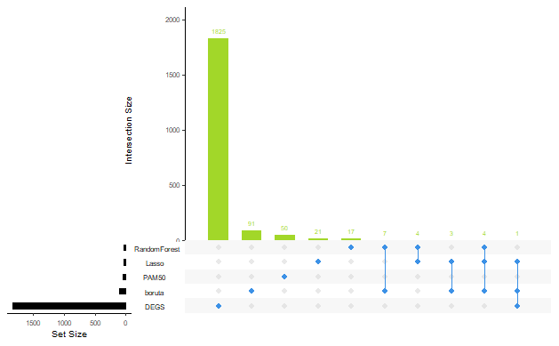
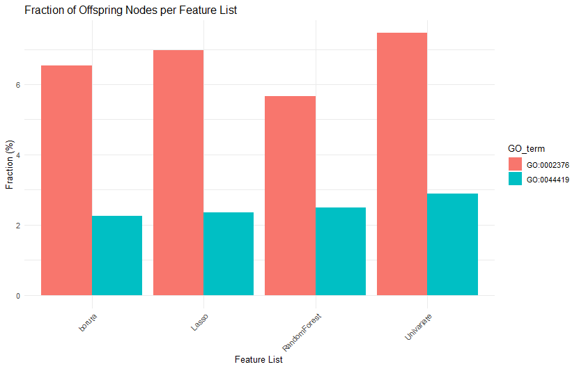
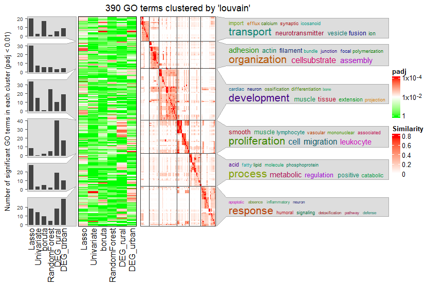

```{r, include = FALSE}
knitr::opts_chunk$set(
  collapse = TRUE,
  comment = "#>", 
  eval = FALSE, #this makes so that chunks are not rerun 
  cache = TRUE,
  warning = FALSE)
```

# 1. Installation and Requirements

## Python requirements

The feature selection procedure is implemented with Python's scikit-learn library. The package requires an Anaconda installation to work properly. The Python requirements are listed in the [requirements.txt](https://github.com/dzhakparov/GeneSelectR/blob/master/inst/python/requirements.txt) file.

You can install the development version of GeneSelectR from GitHub with:

```{r}
# install.packages("devtools")
devtools::install_github("dzhakparov/GeneSelectR", build_vignettes = FALSE)

```

## Before you begin

GeneSelectR is based on usage of Python for feature selection via reticulate. When you install the library and launch it for the first time, it is necessary to create the working environment for the package. To do this there is a convenience function:

```{r}
GeneSelectR::configure_environment() 
```

By running it you will be prompted to install a new conda environment with the default name 'GeneSelectR_env' that will be used in your future GeneSelectR sessions. After that you will be asked if you want necessary Python packages to be installed in this working environment.

Due to restrictions the reticulate package has after this initial step is done, it is necessary to start every of your GeneSelectR session with setting up the correct conda working environment:

```{r}
GeneSelectR::set_reticulate_python()
library(GeneSelectR)
# rest of your code 
```

# 2. Basic Example

## Input Data Requirements

The data matrix should be a data frame with samples as rows and features as columns. Example dataset can be accessed via:

```{r}
data("UrbanRandomSubset")
head(UrbanRandomSubset[,1:10])
```

This dataset is a bulk RNAseq dataset that was obtained from blood samples of the 149 African children that were stratified into ones having Atopic Dermatitis (AD) and healthy controls (HC). Additionally, the whole dataset contains the stratification variable by the children's location (Urban and Rural). This data snippet contains the Urban samples only. The columns represent the genes and samples are in rows. The column treatment contains diagnosis label.

This data subset was used in the PharML 2022 workshop within ECML-PKDD 2022 conference. The whole paper is available with the doi: doi.org/10.1007/978-3-031-23633-4_18

## Feature Selection Procedure Basic Usage

As noted before every new session in which you use GeneSelectR should start with the following line, that would allow you to set the correct conda environment:

```{r}
GeneSelectR::set_reticulate_python()
library(GeneSelectR)
library(dplyr)
# the rest of the code
```

Prior to running the feature selection function, let's prepare the data to have a suitable format:

```{r}
X <- UrbanRandomSubset %>% dplyr::select(-treatment) # get the feature matrix
y <- UrbanRandomSubset['treatment'] # store the data point label in a separate vector
```

### **Important**

Due to how sklearn handles data, it is critical to convert the label column y into numeric representation. For example, you can do it like this:

```{r}
y <- as.factor(y)
y <- as.integer(y)
```

Also, make sure that y is a vector, and not a data frame with one column: 
```{r}
y <- as.vector(y)
```

To run the feature selection procedure with default settings, you should run the GeneSelectR::GeneSelectR() function:

```{r}
selection_results <- GeneSelectR::GeneSelectR(X = X, 
                                              y = y,
                                              njobs = -1) # all cores will be used
selection_results
```

# 3. Feature Selection

## Feature Selection Procedure

1.  *Settings Defaults*: If not provided, default feature selection methods and hyperparameter grids are established.By default there are four methods implemented to select the features: [Univariate feature selection](https://scikit-learn.org/stable/modules/generated/sklearn.feature_selection.GenericUnivariateSelect.html) , [Logistic regression with L1 penalty](https://scikit-learn.org/stable/modules/generated/sklearn.linear_model.LogisticRegression.html), [boruta](https://github.com/scikit-learn-contrib/boruta_py) and [Random Forest](https://scikit-learn.org/stable/modules/generated/sklearn.ensemble.RandomForestClassifier.html). The default grids for every default feature selection method are as follows: 

```{r}
fs_param_grids <- list(
  "Lasso" = list(
    "feature_selector__estimator__C" = c(0.01, 0.1, 1L, 10L),
    "feature_selector__estimator__solver" = c('liblinear','saga')
  ),
  "Univariate" = list(
    "feature_selector__param" = seq(50L, 200L, by = 50L)
  ),
  "boruta" = list(
    "feature_selector__perc" = seq(80L, 100L, by = 10L),
    'feature_selector__n_estimators' = c(50L, 100L, 250L, 500L)
  ),
  "RandomForest" = list(
    "feature_selector__estimator__n_estimators" = seq(100L, 500L,by = 50L),
    "feature_selector__estimator__max_depth" = c(10L, 20L, 30L),
    "feature_selector__estimator__min_samples_split" = c(2L, 5L, 10L),
    "feature_selector__estimator__min_samples_leaf" = c(1L, 2L, 4L),
    "feature_selector__estimator__bootstrap" = c(TRUE, FALSE)
  )
)
```

2.  *Pipeline Selection*: If custom pipelines are provided, they're used. Otherwise, default pipelines are created using the chosen feature selection methods. Pipelines contain two steps: [VarianceThreshold](https://scikit-learn.org/stable/modules/generated/sklearn.feature_selection.VarianceThreshold.html) that is set to 0.85 to filter out low variance features and [StandardScaler](https://scikit-learn.org/stable/modules/generated/sklearn.preprocessing.StandardScaler.html). As per sklearn workflow to prevent data leakage every pipeline is fit on train and test/validate data separately.

3.  *Repeated Train-Test Splitting*: The data undergoes repeated splitting into training and test sets, with the number of repetitions being defined by n_splits. For each split:

-   Pipelines are iterated over for fitting.
-   Each pipeline undergoes a secondary splitting for validation purposes.
-   Hyperparameter tuning is conducted through grid, randomized or grid search with Bayesian Optimization.
-   If the perform_test_split parameter is set to TRUE, the test metrics for the split are computed. Otherwise, only cross validation metrics are reported. 
***Attention***: due to the nature of biomedical data most of the time there is not so many samples available. As a general recommendation it is better to set perform_test_split to FALSE if number of samples is under 100. This way only cross validation performance will be reported.

4.  *Feature Importance Calculation*: For each split and each pipeline, feature importance scores are computed. By default model specific, inbuilt feature importance is reported. If calculate_permutation_importance is set to TRUE, permutation feature importance scores are calculated, in addition to inbuilt feature importance scores.

4.1 *Note on Inbuilt vs Permutation feature importance*: GeneSelectR package offers to ways of selecting features, and it is important to understand the difference in these two approaches. In short, these two methods can be summarized in this manner:

-   *Inbuilt (Model-specific) Feature Importance*:
    -   Nature: Derived directly from the model. For instance, in tree-based models like decision trees or random forests, feature importance is based on the number of times a feature is used to split the data.
    -   Speed: Generally faster as it's a by-product of the model training process.
    -   Bias: Might be biased towards features with more categories or higher cardinality.
-   *Permutation Importance*:
    -   Nature: Calculated by permuting the values of each feature and measuring the decrease in the model's performance. If shuffling a feature's values drops the performance significantly, it's deemed important.
    -   Speed: Can be computationally intensive as it involves multiple evaluations of the model.
    -   Bias: Offers a more unbiased approach, especially for features with high cardinality.

***A Note on Permutation Importance***: Permutation importance provides insights specific to the model it's computed for. A feature that's vital for one model might not be for another. Hence, it's crucial to understand that permutation importance doesn't indicate the intrinsic predictive value of a feature in isolation. Moreover, it's vital to have a trustworthy model (with good cross-validation scores) before considering its permutation importance values. Features deemed unimportant in a poorly performing model could be crucial for a well-performing one. It's always recommended to evaluate a model's predictive power using held-out data or cross-validation prior to computing permutation importances. For more information please refere to the [sklearn official documentation on permutation importance](https://scikit-learn.org/stable/modules/permutation_importance.html). 

**Note:** Permutation Importance calculation is pretty computationally intensive and may increase the time to finish the analysis run. As a general recommendation it should be used if there large computational resources are avaialble. 

5. Hyperparamter adjustment For the sake of computational time the RandomizedSearchCV is used by default. However, if you want to perform an extensive hyperparameter optimization grid search testing all possible combinations can be performed:

```{r}
selection_results <- GeneSelectR::GeneSelectR(X = X, 
                                              y = y,
                                              njobs = -1,
                                              search_type = 'grid')
```

GeneSelectR also supports  scikit-optimize method BayesSearchCV, that performs Bayesian Optimization of hyperparameters. Depending on settings and data it could potentially speed up computation: 

```{r}
selection_results <- GeneSelectR::GeneSelectR(X = X, 
                                              y = y,
                                              njobs = -1,
                                              search_type = 'bayesian')
```

6.  Aggregating Results: Across all the splits, mean inbuilt feature importance values with standard deviation are aggregated for each method. Same is done for the permutation importance if it is enabled. Additionally, rank for every feature at every data split is reported.

## Customizing GeneSelectR Workflow with Other sklearn Methods

The GeneSelectR workflow is highly customizable depending on your needs. For example, if you wish to add any other feature selection methods from sklearn, you should pass it as a named list like this:

```{r}
# sklearn is already imported when the library is loaded 
# define the feature selection submodule and wanted methods with an estimator
feature_selection <- sklearn$feature_selection
select_from_model <- feature_selection$SelectFromModel
RFE <- feature_selection$RFE
rf <- sklearn$ensemble$RandomForestClassifier

# feature selection methods of your choice 
my_methods <- list('RFE' = RFE(estimator = rf(), n_features_to_select = 100L),
                   'SelectFromModel' = select_from_model(estimator = rf()))

```

The parameters for the methods should be passed like this with a prefix 'feature_selector\_\_' for every parameter:

```{r}
# params for the feature selection methods of your choice 
my_params <- list('RFE' = list('feature_selector__step' = seq(0.1, 0.001, 1, 10)),
                  'SelectFromModel' = list('feature_selector__estimator__n_estimators' = c(50L, 100L, 250L, 500L),
                                           "feature_selector__estimator__max_depth" = c(10L, 20L, 30L),
                                           "feature_selector__estimator__bootstrap" = c(TRUE, FALSE))
                  )
```

Finally, we can pass it as an arguments to the GeneSelectR() function: 

```{r}
selection_results <- GeneSelectR::GeneSelectR(X = X, 
                                              y = y,
                                              njobs = -1,
                                              feature_selection_methods=my_methods,
                                              fs_param_grids = my_params)
```

Other than feature selection methods, preprocessing steps as well as other estimators for classifications can be passed. For example, if you want to pass other preprocessing steps you can do it like this:

```{r}
minmax <- sklearn$preprocessing$MinMaxScaler()
varthr <- sklearn$feature_selection$VarianceThreshold()
preprocessing <- list( 'MinMaxScaler' = minmax, 
                       'VarianceThreshold' = varthr)

selection_results <- GeneSelectR::GeneSelectR(X = X, 
                                              y = y,
                                              njobs = -1,
                                              feature_selection_methods=my_methods,
                                              fs_param_grids = my_params,
                                              preprocessing_steps = preprocessing)
```

Same can be done with the classifiying estimator. For example if you want to use the XGBoost classifier instead of the default random forest:

```{r}
# import xgboost 
# NOTE: it should be installed in the working conda env 
xgb <- reticulate::import('xgboost')
xgb.classifier <- xgb$XGBClassifier()

selection_results <- GeneSelectR::GeneSelectR(X = X, 
                                              y = y,
                                              njobs = -1,
                                              classifier = xgb.classifier)
```

Note: if you supply your own classifier, you have to specify the parameter grid for it with a 'classifier\_\_' prefix:

```{r}
xgb <- reticulate::import('xgboost')
xgb.classifier <- xgb$XGBClassifier()

xgb_param_grid <- list(
  "classifier__learning_rate" = c(0.01, 0.05, 0.1),
  "classifier__n_estimators" = c(100L, 200L, 300L),
  "classifier__max_depth" = c(3L, 5L, 7L),
  "classifier__min_child_weight" = c(1L, 3L, 5L),
  "classifier__gamma" = c(0, 0.1, 0.2),
  "classifier__subsample" = c(0.8, 1.0),
  "classifier__colsample_bytree" = c(0.8, 1.0)
)

selection_results <- GeneSelectR::GeneSelectR(X = X, 
                                              y = y,
                                              njobs = -1,
                                              classifier = xgb.classifier,
                                              classifier_grid = xgb_param_grid)
```

# 4. Machine Learning Performance Results Inspection

## Structure of the PipelineResults object

The function returns an object of class "PipelineResults", containing:\
- 'best_pipeline': A named list containing parameters of the best performer pipeline.

-   'cv_results': Results of cross-validation for each pipeline.

-   'inbuilt_feature_importance': Aggregated inbuilt feature importance scores.

-   'test_metrics': If the perform_split parameter was set to TRUE, a dataframe of test metrics for each pipeline is returned.

\-'cv_mean_score': A dataframe that summarizes the mean cross-validation scores.

-   'permutation_importance': If permutation importance was calculated, its mean values are returned.

## Feature Importance Plots

Finally, you can visualize the most important features for every feature importance method calculation by calling the plotting function:

```{r}
plot_feature_importance(selection_results, top_n_features = 10)
```

::: {style="text-align:center"}

:::

The plot will show you the mean feature importance of top n features of your choice by their importance score in descending order.

## ML Performance Metrics

You can plot the feature selection procedure metrics with the following function:

```{r}
plot_metrics(selection_results)

# or access it as a dataframe 
selection_results$test_metrics 
selection_results$cv_mean_score
```

 


## Overlap Between Gene Lists

Additionally, you can inspect whether genes in your feature selection lists have overlapping features. To do that use the following:

```{r}
overlap <- calculate_overlap_coefficients(selection_results)
overlap 
```

This will return a dataframe that demonstrates three types of overlap coefficients for inbuilt feature importance and permutation importance (if calculated): Soerensen-Dice, Overlap and Jaccard. The coefficients can also be visualized as overlap heatmaps. To do so do the following: 

```{r}
plot_overlap_heatmaps(overlap)
```

 

Additionally, if you have any custom lists (e.g. differential gene expression list) you can pass it as an argument like this:

```{r}
custom_list <- list(custom_list = c('char1','char2','char3','char4','char5'),
                    custom_list2 = c('char1','char2','char3','char4','char5'))
overlap1 <- calculate_overlap_coefficients(selection_results, custom_lists = custom_list)
plot_overlap_heatmaps(overlap1)
```

::: {style="text-align:center"}
 
:::

## Upset plot 
To get the exact numbers of intersections between the feature lists you can use the upset plot function:

```{r}
upset_upet(selection_results)

# plot upset with custom lists 
upset_upet(selection_results, custom_lists = custom_list)

```

::: {style="text-align:center"}
 
:::

# 5.GO Enrichment analysis

## Annotation of Selected Genes

For your convenience there is a wrapper function for clusterprofiler(link) GO enrichment implemented, along with a function to get gene annotations. After GeneSelectR has been run, to fetch gene annotations do the following:

```{r}
# Get the annotations for the genes in the analysis 
# The example dataset contains sequencing from humans 
ah <- AnnotationHub::AnnotationHub()
human_ens <- AnnotationHub::query(ah, c("Homo sapiens", "EnsDb"))
human_ens <- human_ens[['AH98047']]
annotations_ahb <- ensembldb::genes(human_ens, return.type = "data.frame") %>%
 dplyr::select(gene_id,gene_name,entrezid,gene_biotype)

annotations_df <- annotate_gene_lists(pipeline_results = selection_results, 
                                      annotations_ahb = annotations_ahb,
                                      format = 'ENSEMBL')
annotations_df
```

The format argument can be set to three possible options: (1) 'ENSEMBL' (eg. ENSGXXXXXXX), (2) 'SYMBOL' (eg. TSPAN) or ENTREZ ID. The resulting AnnotatedGeneLists class object contains following fields:

```{r}
# Formal class 'AnnotatedGeneLists' [package "GeneSelectR"] with 2 slots
#   ..@ inbuilt    :List of 4
#   .. ..$ Lasso       :Formal class 'GeneList' [package "GeneSelectR"] with 3 slots
#   .. .. .. ..@ SYMBOL  : chr [1:54] "MCOLN3" "AGL" "NBPF26" "EXO1" ...
#   .. .. .. ..@ ENSEMBL : chr [1:54] "ENSG00000055732" "ENSG00000162688" "ENSG00000273136" "ENSG00000174371" ...
#   .. .. .. ..@ ENTREZID: chr [1:54] "55283" "178" "101060684" "9156" ...
#   .. ..$ Univariate  :Formal class 'GeneList' [package "GeneSelectR"] with 3 slots
#   .. .. .. ..@ SYMBOL  : chr [1:74] "CDA" "BMP8B" "MCOLN3" "AGL" ...
#   .. .. .. ..@ ENSEMBL : chr [1:74] "ENSG00000158825" "ENSG00000116985" "ENSG00000055732" "ENSG00000162688" ...
#   .. .. .. ..@ ENTREZID: chr [1:74] "978" "656" "55283" "178" ...
#   .. ..$ RandomForest:Formal class 'GeneList' [package "GeneSelectR"] with 3 slots
#   .. .. .. ..@ SYMBOL  : chr [1:73] "CDA" "BMP8B" "MCOLN3" "NBPF26" ...
#   .. .. .. ..@ ENSEMBL : chr [1:73] "ENSG00000158825" "ENSG00000116985" "ENSG00000055732" "ENSG00000273136" ...
#   .. .. .. ..@ ENTREZID: chr [1:73] "978" "656" "55283" "101060684" ...
#   .. ..$ boruta      :Formal class 'GeneList' [package "GeneSelectR"] with 3 slots
#   .. .. .. ..@ SYMBOL  : chr [1:36] "MCOLN3" "AGL" "NBPF26" "BNIPL" ...
#   .. .. .. ..@ ENSEMBL : chr [1:36] "ENSG00000055732" "ENSG00000162688" "ENSG00000273136" "ENSG00000163141" ...
#   .. .. .. ..@ ENTREZID: chr [1:36] "55283" "178" "101060684" "149428" ...
#   ..@ permutation:List of 4
#   .. ..$ Lasso       :Formal class 'GeneList' [package "GeneSelectR"] with 3 slots
#   .. .. .. ..@ SYMBOL  : chr [1:4] "HBB" "" "ABCC12" "LTF"
#   .. .. .. ..@ ENSEMBL : chr [1:4] "ENSG00000244734" "ENSG00000259529" "ENSG00000140798" "ENSG00000012223"
#   .. .. .. ..@ ENTREZID: chr [1:4] "3043" "NA" "94160" "4057"
#   .. ..$ Univariate  :Formal class 'GeneList' [package "GeneSelectR"] with 3 slots
#   .. .. .. ..@ SYMBOL  : chr [1:19] "KAZN" "RGS16" "IGFN1" "CHI3L1" ...
#   .. .. .. ..@ ENSEMBL : chr [1:19] "ENSG00000189337" "ENSG00000143333" "ENSG00000163395" "ENSG00000133048" ...
#   .. .. .. ..@ ENTREZID: chr [1:19] "23254" "6004" "91156" "1116" ...
#   .. ..$ RandomForest:Formal class 'GeneList' [package "GeneSelectR"] with 3 slots
#   .. .. .. ..@ SYMBOL  : chr [1:16] "ZBED6" "CYP2E1" "HBB" "OTOGL" ...
#   .. .. .. ..@ ENSEMBL : chr [1:16] "ENSG00000257315" "ENSG00000130649" "ENSG00000244734" "ENSG00000165899" ...
#   .. .. .. ..@ ENTREZID: chr [1:16] "100381270" "1571" "3043" "283310" ...
#   .. ..$ boruta      :Formal class 'GeneList' [package "GeneSelectR"] with 3 slots
#   .. .. .. ..@ SYMBOL  : chr [1:8] "CHI3L1" "HBB" "IDH1" "PTPRN" ...
#   .. .. .. ..@ ENSEMBL : chr [1:8] "ENSG00000133048" "ENSG00000244734" "ENSG00000138413" "ENSG00000054356" ...
#   .. .. .. ..@ ENTREZID: chr [1:8] "1116" "3043" "3417" "5798" ...
```

For example, ENTREZID for Random Forest gene list derived from inbuilt feature importance can be accessed like this:

```{r}
print(annotated_df@inbuilt$RandomForest@ENTREZID)
```

You can also add custom lists (eg. background for enrichment, differential gene expression list) to fetch annotations for them:

```{r}
custom_list <- list(background = c('gene1', 'gene2', 'gene3', 'gene4'), 
                    DEGs = c('gene5','gene6','gene7'))
annotations_df_with_custom <- annotate_gene_lists(pipeline_results = selection_results, 
                                      annotations_ahb = annotations_ahb,
                                      format = 'ensembl_gene_name', 
                                      custom_lists = custom_list)
annotations_df_with_custom
```

## GO Enrichment Analysis

There is a wrapper function to run GO enrichment analysis with the [clusterprofiler](https://guangchuangyu.github.io/software/clusterProfiler/) package. To run a GO enrichment analysis with default settings simply run:

```{r}
annotated_GO <- GO_enrichment_analysis(annotated_df)
```

This function can take different arguments depending on your need:

```{r}
annotated_GO <- GO_enrichment_analysis(annotated_df,
                                       list_type = 'permutation', #run GO enrichment on permutation based selected features 
                                       keyType = 'ENSEMBL', # run analysis with ENSEMBLIDs  
                                       ont = 'BP') # run BP ontology
annotated_GO
```

The returned object is a list containing clusterprofiler enrichResult for every feature selection list.

## Visualization of Parent Term Fractions

You can calculate what is the fraction of target parent GO terms is enriched in your feature selection lists:

```{r}
annot_child_fractions <- compute_GO_child_term_metrics(GO_data = annotated_GO,
                              GO_terms = c("GO:0002376", "GO:0044419"),
                              plot = FALSE)
```

This will produce a dataframe containing information on number of children terms of specified terms, number of all the terms and fraction of children terms related to the parent one in the total number of identified GO terms (without p-value filtering) and hypergeometric test p-value:

```{r}
str(annot_child_fractions)
# 'data.frame':	12 obs. of  6 variables:
#  $ feature_list          : chr  "Lasso" "Univariate" "RandomForest" "boruta" ...
#  $ all_terms_number      : int  5413 5421 5981 4643 1308 1752 5413 5421 5981 4643 ...
#  $ offspring_nodes_number: int  432 449 495 379 196 170 112 110 128 100 ...
#  $ offspring_terms       : chr  "GO:0001767;GO:0001768;GO:0001771;GO:0001773;GO:0001774;GO:0001776;GO:0001779;GO:0001780;GO:0001782;GO:0001787;G"| __truncated__ "GO:0001767;GO:0001768;GO:0001771;GO:0001773;GO:0001774;GO:0001776;GO:0001780;GO:0001782;GO:0001787;GO:0001909;G"| __truncated__ "GO:0001767;GO:0001768;GO:0001771;GO:0001773;GO:0001774;GO:0001776;GO:0001779;GO:0001782;GO:0001787;GO:0001865;G"| __truncated__ "GO:0001767;GO:0001768;GO:0001771;GO:0001773;GO:0001774;GO:0001776;GO:0001779;GO:0001780;GO:0001782;GO:0001865;G"| __truncated__ ...
#  $ fraction              : num  7.98 8.28 8.28 8.16 14.98 ...
#  $ GO_term               : chr  "GO:0002376" "GO:0002376" "GO:0002376" "GO:0002376" ...
```

If the plot argument is set to TRUE it will produce a following plot: 

::: {style="text-align:center"}

:::

# 6. Semantic Similarity Analysis

## simplifyEnrichment Wrapper Function

Final step of the analysis is the clustering and semantic similarity analysis of GO Terms from every list. This is done with the[simplifyEnrichment R package](https://github.com/jokergoo/simplifyEnrichment). For the convenience of data input, there is a wrapper for simplifyGOFromMultipleLists() function implemented:

```{r}
# simplifyEnrichment produces a heatmap
hmap <- run_simplify_enrichment(annotated_GO,
                                method = 'lovain',
                                measure = 'Resnik')
```

This will produce a heatmap with clustered GO terms from the feature selecton lists methods:

::: {style="text-align:center"}

:::

For more information on simplifyEnrichment please visit the official package [webpage](https://github.com/jokergoo/simplifyEnrichment).
